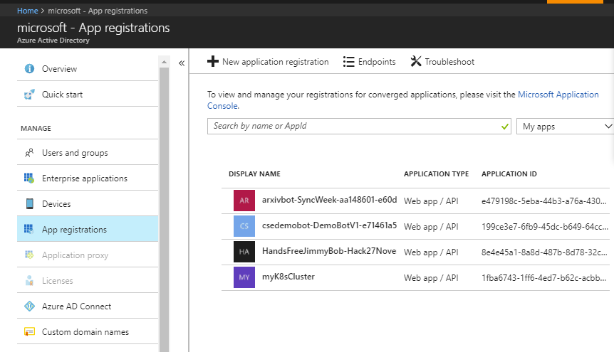

# Sesame 
A bolt-on voice identification and authentication service for any App or API.

## What is it?

This project allows you to add voice identification to any site compatible with OpenId Connect based authentication flows. It is a OpenId Connect server written in ASP.NET Core 2 that can be used as a base to create your own authentication system. [Example](https://github.com/CSEANZ/Sesame/tree/master/Samples) client apps provided are for ASP.NET Core and ASP.NET Classic MVC. 

The core tenet of the approach taken in this solution is to ensure it doesn't tightly bind our solution to the client site's source code. The end result is an [OAuth2](https://oauth.net/2/)/[OpenID Connect](http://openid.net/connect/) compatible authentication web site that can be used to authenticate using voice from any website that supports an OpenID Connect based authentication flow. 

The project was developed as part of a collaboration by [South32](https://www.south32.net/) and Microsoft engineers.  

## Key Technologies

- [Speaker Recognition API](https://azure.microsoft.com/en-au/services/cognitive-services/speaker-recognition/)
- [ASP.NET Core 2](https://docs.microsoft.com/en-us/aspnet/core/)
- [OpenIddict](https://github.com/openiddict)
- [Azure Active Directory](https://docs.microsoft.com/en-us/azure/active-directory/active-directory-whatis)


## How does it work?

Take the example of a bot website that is used in a situation where a user cannot interact with a keyboard to enter their authentication information - perhaps they are wearing safety equipment like gloves and goggles. 


*Example flow for a bot client site*

There are two main stages to the process - enrolment and verification. 

### Enrolment

Before a user may use their voice to log-in to the bot, they must enrol. The idea is that once they have enrolled they may then use any of the field stations to log in using their voice in the future. 

This process starts by logging the user in to Azure Active Directory and getting their access tokens and refresh tokens and saving them to a cache for later. Next the user will be asked to enrol their voice for identification. This involves selecting a phrase from a pre-determined list and repeating that phrase three times. 

Once the speaker enrolment is complete, the details are saved in a database and the user may now log in to the protected web page using their voice. 

The user is provided with a unique PIN which they will need to use later as part of the login process. 

In the scenario of a refinery here, the user would enrol in an office environment using a laptop with a microphone. 

### Verification

The user has enrolled at some time in the past and would now like to use the protected web site (in this case a bot) without using their hands. The user approaches a bot field station (which is a PC with a good quality microphone). The field station is sitting on the bot idle page - waiting for them to initiate a log in. 

For privacy purposes the system avoids having the browser microphone on  unless the user indicates they are ready to log in. The listening process will start only by user interaction. The user kicks off the login by pressing any key - such as space bar which is easy enough to do even when wearing gloves. 

The ASP.NET site that is hosting the bot webpage will detect that it is not authenticated and cause a login redirection flow via OpenId Connect. This flow will take the user to the same Sesame site and ask them to enter their PIN using their voice. 

The user reads aloud their PIN and the login system goes and searches the database for that user. The PIN is used in this scenario like a User Id - a unique identifier to find the user in the system and present them with their voice login prompt. 

The user will next be asked to say aloud their voice authentication phrase. 

Once voice login is successful, the system will grab the Azure Active Directory token from the distributed cache and check it for validity (including performing a refresh if needed) to ensure the user is still a valid user in the AAD system. 

Upon validation, the OpenID Connect system will redirect back to the protected (bot) site and complete the login flow. 

The user may now use the bot using their voice until a timeout or manual logout occurs. Once the user is finished, the bot will log them out and return to the idle page awaiting the next login

### OpenId Connect

[OpenID Connect](http://openid.net/connect/) is an extension of [OAuth2](https://oauth.net/2/). It allows a site to delegate authentication to another site without compromising security. This solution uses OpenId connect as it is well supported and easy to integrate to a web site without heavy modification. 

### OpenIddict

OAuth 2 and OpenId Connect a simple to use, but difficult to implement. Luckily a lot of the heavily lifting has been done in projects such as [Identity Server](https://github.com/identityserver) and [OpenIddict](https://github.com/openiddict) which is based on ASOS ([AspNet.Security.OpenIdConnect.Server](https://github.com/aspnet-contrib/AspNet.Security.OpenIdConnect.Server)).


# A note about security

This mode of authentication is weaker than regular 2FA. It is suggested that you limit the capabilities of the client app appropriately. 

  

# Getting Started

This documentation will show the process from Visual Studio Code. 

### Required Software

Before you begin you'll need the following software installed:

- Visual Studio or Visual Studio Code [https://www.visualstudio.com/](https://www.visualstudio.com/)
- [ASP.NET Core 2](https://www.microsoft.com/net)
- [Postman](https://www.getpostman.com/)
- [Git](https://git-scm.com/book/en/v2/Getting-Started-Installing-Git)
- [SQL Server Express LocalDB](https://docs.microsoft.com/en-us/sql/database-engine/configure-windows/sql-server-2016-express-localdb)

### Clone the repo

Start by cloning the [repo](https://github.com/CSEANZ/Sesame) ([Visual Studio Code](https://code.visualstudio.com/docs/editor/versioncontrol), [command line](https://help.github.com/articles/cloning-a-repository/)). 

Navigate to the parent directory that you want to clone in to a sub-folder of and type:

```
git clone https://github.com/CSEANZ/Sesame.git
```

### Make sure it builds

#### ASP.NET Core

ASP.NET Core 2 is the latest version of the open source, cross platform version of ASP.NET. It's fast and powerful and has a great programming architecture based around dependency injection and configuration. 

You'll need at least version 2 of `.NET Core` installed to run it. You can check your version by running the following command:

```
dotnet --version
```

At the time of writing the latest version was `2.1.2`. 

.NET Core can be easily edited and built from the command line, Visual Studo Code or Visual Studio 2017.

From the cloned directory locate the "Server" folder and open it in Visual Studio Code (File->Open Folder). 

Code may show you a bunch of messages at the top of the screen. It might ask you to Add Missing Assets - allow this. It may also ask you to restore, you can do that to - although we're going to do that manually next. 

#### Building .NET Core 

.NET Core needs to have it's packages restored before you can build (ala Node.JS). 

Open a new [terminal window](https://code.visualstudio.com/docs/editor/integrated-terminal) in code. And type the following:

```
dotnet restore
```

You will see a bunch of output showing what was restored. 

```
C:\Users\jak\Documents\GitHub\Sesame\Server>dotnet restore
  Restoring packages for C:\Users\jak\Documents\GitHub\Sesame\Server\Sesame.Web\Sesame.Web.csproj...
  ...
  Restore completed in 946.34 ms for C:\Users\jak\Documents\GitHub\Sesame\Server\Sesame.Web\Sesame.Web.csproj.
  ```

You may now build the site. 

```
dotnet build
```

#### Trust the SSL Certificate

During development the server will need to use SSL as [Azure Active Directory](https://docs.microsoft.com/en-us/azure/active-directory/active-directory-whatis) will not operate otherwise. When running in Visual Studio it will handle this for you - the SSL certificate will be installed and trusted automatically (with a prompt asking first).

When running from Visual Studio Code or a terminal window things get a little more complex as a certificate has to be configured in code. 

The certificate is referenced in `Program.cs`

```csharp
listenOptions.UseHttps("devcert.pfx", "dev");
```

This certificate needs to be trusted. 

The certificate in the root of the project folder (Sesame\Sesame.Web ). This cert will need to be installed in Local Computer\Trusted Root Certification Authority folder (password is dev). Double click the certificate and follow the prompts to install it (on Windows). 

The process for creating a certificate and trusting on Mac can be found [here](https://www.humankode.com/asp-net-core/develop-locally-with-https-self-signed-certificates-and-asp-net-core).

#### Running the project

There are a few ways to run the app. in the `Sesame.Web` folder you can type `dotnet run` and it will boot the app. 

You can also run the site in Visual Studio (code and 2017) by pressing F5. 

See [this tutorial](https://docs.microsoft.com/en-us/aspnet/core/tutorials/first-mvc-app-xplat/start-mvc) for building ASP.NET Core sites in Visual Studio Code. 

**Note:** If you're getting an Access Denied error on the line that loads the certificate in Visual Studio 2017 then run Visual Studio as administrator. 

A nice way to run a .NET Core app is to use `dotnet watch run`. This will continuously rebuild and start the app as you go much like `nodemon` in Node.js world. 

#### Databases

The Sesame site uses a number of different databases for perform various caching and storage roles. 

- [Distributed](https://docs.microsoft.com/en-us/aspnet/core/performance/caching/distributed) session cache database - ASP.NET Core needs to be able to save session state to a distributed cache, so when the app scales across server instances, the cache is available. 
- [Distributed](https://docs.microsoft.com/en-us/aspnet/core/performance/caching/distributed) token cache database - similar to the session cache, the token cache needs to be accessible across servers.
- [OpenIddict](https://github.com/openiddict) database - OpenIddict will use a database to store things like available applications (client id, client secret etc) as well as token grant codes amongst other things.
- User database - a database specific to Sesame that stores pairings between AAD users and voice ID users, including tokens, pins and other required information.

#### User Secrets   
It's best not to store any secret connection strings in source control - especailly when it's open source! To get around this, .NET Core supports a feature called [Secret Manager](https://docs.microsoft.com/en-us/aspnet/core/security/app-secrets?tabs=visual-studio). 

User secrets are enabled by editing the .csproj file and adding `<DotNetCliToolReference Include="Microsoft.Extensions.SecretManager.Tools" Version="2.0.0" />` to an `ItemGroup` tag (fin teh other tools and add it with them). 

Also add `<UserSecretsId>User-Secret-ID</UserSecretsId>` to the `<PropertyGroup>` near the top of the file. You can change the secrets id to be anything else - like Sesame. 

You'll also need to tell the configuration to use your secrets in `Startup.cs`. 

``` csharp
public Startup(IHostingEnvironment env)
{
    var builder = new ConfigurationBuilder();

    if (env.IsDevelopment())
    {
        builder.AddUserSecrets<Startup>();
    }

    Configuration = builder.Build();
}
```

##### Editing User Secrets

You can edit secrets by locating the `secrets.json` file. In Visual Studio, right click the project and select "Manage User Secrets". Alternatively in explorer (etc) locate the `secrets.json` file here: 

`Windows: %APPDATA%\microsoft\UserSecrets<userSecretsId>\secrets.json`

`Linux: ~/.microsoft/usersecrets/<userSecretsId>/secrets.json`

`Mac: ~/.microsoft/usersecrets/<userSecretsId>/secrets.json`


Add the following to the file:

```json
{
    "ConnectionStrings": {
        "OidcCache": "Server=(localdb)\\mssqllocaldb;Database=OIDC;Trusted_Connection=True;MultipleActiveResultSets=true;",
        "TokenCache": "Server=(localdb)\\mssqllocaldb;Database=SesameCache;Trusted_Connection=True;MultipleActiveResultSets=true;",
        "SessionState": "Server=(localdb)\\mssqllocaldb;Database=SesameSessionState;Trusted_Connection=True;MultipleActiveResultSets=true;",
        "UserMaps": "Server=(localdb)\\mssqllocaldb;Database=SesameUserMaps;Trusted_Connection=True;MultipleActiveResultSets=true;"
    },
    "SpeakerRecognitionKey": "7507f2b53b5c48888ab869704141ba2b"
}
```


#### Database init

The two cache databases need to be initalised, but the OpenIddict and User database do not as they use [Entity Framework](https://docs.microsoft.com/en-us/ef/core/get-started/aspnetcore/new-db) to do the heavy lifting for us. 

To setup the production cache, create two new databases called `SesameCache` and `SesameSessionState` in (localdb)\mssqllocaldb. To do this you can use [SQL Server Management Studio](https://docs.microsoft.com/en-us/sql/ssms/download-sql-server-management-studio-ssms) or you can use the SQL Server Object Explorer in Visual Studio 2017. 

Next navigate to `Sesame\Sesame.Web` in a terminal window and run:

```dotnet sql-cache create "Server=(localdb)\mssqllocaldb;Database=SesameSessionState;Trusted_Connection=True;MultipleActiveResultSets=true;" dbo Cache```

and

```dotnet sql-cache create "Server=(localdb)\mssqllocaldb;Database=SesameCache;Trusted_Connection=True;MultipleActiveResultSets=true;" dbo Cache```.

This will create the required tables in the local db for caching using ASP.NET. 

## Enrolment

Enrolment is completed by saying a phrase, chosen from a [list of phrases](https://azure.microsoft.com/en-au/services/cognitive-services/speaker-recognition/), three times.

To record each utterance of the chosen phrase and format to the [requirements of the Speaker Recognition API](https://westus.dev.cognitive.microsoft.com/docs/services/563309b6778daf02acc0a508/operations/5645c3271984551c84ec6797), [cwilso/AudioRecorder](https://github.com/cwilso/AudioRecorder) is used. Try the [demo](https://webaudiodemos.appspot.com/AudioRecorder/index.html) and read about the [Web Audio API](https://dvcs.w3.org/hg/audio/raw-file/tip/webaudio/specification.html).

1. First, the list of phrases are [displayed for selection](https://github.com/CSEANZ/Sesame/blob/master/Server/Sesame.Web/wwwroot/js/speaker-verification.js#L66)
2. Then, a [Verification Profile](https://westus.dev.cognitive.microsoft.com/docs/services/563309b6778daf02acc0a508/operations/563309b7778daf06340c9652) is [created](https://github.com/CSEANZ/Sesame/blob/master/Server/Sesame.Web/wwwroot/js/speaker-verification.js#L93)
3. A recording of [each utterance](https://github.com/CSEANZ/Sesame/blob/master/Server/Sesame.Web/wwwroot/js/speaker-verification.js#L16) is made
4. Which are [added to the Verification Profile](https://github.com/CSEANZ/Sesame/blob/master/Server/Sesame.Web/wwwroot/js/speaker-verification.js#L153)
5. Finally, after [three successful recordings](https://github.com/CSEANZ/Sesame/blob/master/Server/Sesame.Web/wwwroot/js/speaker-verification.js#L121), the User is prompted to [enter a pin](https://github.com/CSEANZ/Sesame/blob/master/Server/Sesame.Web/wwwroot/js/speaker-verification.js#L26) as a second factor

### Authenticate Users with Azure Active Directory
The Sesame.Web project was configured to obtain identities from Azure Active Directory using Visual Studio 2017.


#### Configure Sesame to use your Azure Active Directory

Log into the [Azure Portal](https://portal.azure.com) and search for *Active Directory*. 

* From the sidebar, select *App Registrations*
* Create a `New Application Registration`
* Name your app and select *Web App / API*
* Set the login url to `http://localhost:52945/signin-oidc` (or equivalent) and **save**
* Under YOUR_NEW_APP > *Settings* > *Required Permissions*, make sure Sign in and Read User Profile is enabled. 
* Click *Grant Permissions*.

 


Back in the Sesame code, open `appsettings.json` and set the following values under *OpenIdConnect* from the Azure Portal.

* ClientId -> your Application ID from Azure Portal
* ClientSecret -> Create a secret in *Settings* > *Keys* named `ClientSecret`
* \<your tenant id> -> Guid found in *App Registrations* > *Endpoints* blade.


#### Distributed Token Cache
When creating a .NET Core 2.0 Web API or Web Application using Visual Studio 2017, the [Microsoft.NETCore.App](https://www.nuget.org/packages/Microsoft.NETCore.App) [metapackage](https://docs.microsoft.com/en-us/dotnet/core/packages#metapackages) is included as a dependency, which contains the [Azure Active Directory Authentication Library](https://docs.microsoft.com/en-us/azure/active-directory/develop/active-directory-authentication-libraries) (ADAL). ADAL makes authentication easier for developers with features including:

- A configurable token cache that stores access tokens and refresh tokens, and
- Automatic token refresh when an access token expires and a refresh token is available in the cache

To authenticate with Azure Active Directory and obtain access tokens and refresh tokens, an [AuthenticationContext](https://github.com/CSEANZ/Sesame/blob/master/Server/Sesame.Web/Extensions/OpenIdAuthenticationOptionsExtensions.cs#L38) is created. An `AuthenticationContext` can optionally use a `TokenCache` to store tokens. When an `AuthenticationContext` is used to acquire a token (e.g. with [AcquireTokenAsync](https://docs.microsoft.com/en-us/dotnet/api/microsoft.identitymodel.clients.activedirectory.authenticationcontext.acquiretokenasync?view=azure-dotnet)), the cache is used to lookup cached tokens.

By default, a `TokenCache` [uses an IDictionary](https://github.com/AzureAD/azure-activedirectory-library-for-dotnet/blob/0dec7a635ac3b4793b2e7b6396d5b06501b46368/src/Microsoft.IdentityModel.Clients.ActiveDirectory/TokenCache.cs#L56) which won't scale to two or more servers, and so [AdalDistributedTokenCache](https://github.com/CSEANZ/Sesame/blob/master/Server/Sesame.Web/Services/AdalDistributedTokenCache.cs) was created, which extends `TokenCache`, and takes an implementation of an [IDistributedCache](https://github.com/aspnet/Caching/tree/dev/src) instead.

### Startup.cs

During [Startup](https://github.com/CSEANZ/Sesame/blob/master/Server/Sesame.Web/Startup.cs#L67), Sesame is configured with a cache that persists token to disk in JSON format, used for unit testing or a cache that persists to SQL Server, either on-premises or in the cloud, used for integration testing and production.

### Database store  (saving user / voice print id pairings etc)

The application uses an [Entity Framework](https://docs.microsoft.com/en-us/ef/core/get-started/aspnetcore/new-db) code first database. This database is initialised in [OpenIddictDatabaseHelpers.cs](https://github.com/CSEANZ/Sesame/blob/master/Server/Sesame.Web/Helpers/OpenIddictDatabaseHelpers.cs#L24) which is called during initialisation from `Startup.cs`. 

Operations on this database are perfomed by taking a dependency on the `[PersistentStorageService](https://github.com/CSEANZ/Sesame/blob/master/Server/Sesame.Web/Services/PersistentStorageService.cs)` via the [`IPersistentStorageService`](https://github.com/CSEANZ/Sesame/blob/master/Server/Sesame.Web/Services/IPersistentStorageService.cs). 

To take the dependency `IPersistentStorageService` is injected to the constructor in [`VerificationProfilesController`](https://github.com/CSEANZ/Sesame/blob/master/Server/Sesame.Web/Controllers/VerificationProfilesController.cs). 

```csharp
public VerificationProfilesController(IConfiguration configuration, 
    ISessionStateService sessionStateService,
    SpeakerRecognitionClient mSpeakerRecognitionClient,
    IPersistentStorageService persistantStorageService)
```

Database operations can now be performed on the injected instance. 

```csharp
verificationProfileId = await _persistantStorageService.GetSpeakerVerificationProfileByPinAsync(pin);
```

The `IPersistentStorageService` is configured for depency injection in [`Startup.cs`](https://github.com/CSEANZ/Sesame/blob/master/Server/Sesame.Web/Startup.cs#L61).

```csharp
services.AddSingleton<IPersistentStorageService, PersistentStorageService>();
```

### OpenID Connect

OpenId Connect is used to orchestrate the authentication process as it's standards based and well supported on a range of platforms. [Samples](https://github.com/CSEANZ/Sesame/tree/master/Samples) are provided for ASP.NET Core and ASP.NET MVC 4. 

#### Create a new app

Before an app (like a website) can log in using your OpenId Connect server (Sesame) an app must be created. When you first run Sesame, a couple of client apps are created automatically by [`OpenIddictDatabaseHelpers`](https://github.com/CSEANZ/Sesame/blob/master/Server/Sesame.Web/Helpers/OpenIddictDatabaseHelpers.cs#L37). 

These database entries can be explored in the `OIDC` database under the `OpenIddictApplications` table. 


You can add and remove application settings here. 

#### Authentication Flow Types

There are a number of different authentication flows that are possible using OAuth (which OpenId Connect uses). The two flows supported by Sesame are "Authorization Code" and "Implicit". 

##### Authorization Code Flow
This flow type is the most secure and support in ASP.NET Core sites amongst other things. During this flow the client browser never has the possibility to see the token, thus the token is always kept safe. 

##### Implicit Flow
In this flow type an id_token is returned to the client and it may be intercepted / traded for an authentication token by the client. This flow type can be dangerous if you do not trust the client with powerful tokens. In Sesame, the tokens are only used by the calling site, so there is no danger if the tokens are intercepted by the caller. 

#### Configuring the OpenId Connect Server

The server flow is configured in [`OpenIddictServerExtensions`](https://github.com/CSEANZ/Sesame/blob/master/Server/Sesame.Web/Extensions/OpenIddictServerExtensions.cs) which is called from `Startup.cs`. 

Of interest are the lines:

```csharp
options.AllowAuthorizationCodeFlow();
options.AllowImplicitFlow();
```

Also of interest are the following lines which configure the token grand end points that the calling apps will navigate to. 

```csharp
options.EnableAuthorizationEndpoint("/connect/authorize")
    .EnableLogoutEndpoint("/connect/logout")
    .EnableTokenEndpoint("/connect/token")
    .EnableUserinfoEndpoint("/api/userinfo");
```

You'll find these controllers are configured in [AuthorizationController](https://github.com/CSEANZ/Sesame/blob/master/Server/Sesame.Web/Controllers/AuthorizationController.cs#L57). 

```csharp
[HttpGet("~/connect/authorize")]
public async Task<IActionResult> Authorize(OpenIdConnectRequest request)
{
```

There are two or three calls to this server depending on the type of authorisation flow that is requested by the client app. 

- Authorize - the page that is shown to the user who is loogging in (where they will be asked for verify their voice print id).
- Accept - the controller that is called when the user is to be granted login.
- Exchange - the controller that is called when the calling app exchanges the code or id_token for an authentication token. 

These flow types are demonstrated in the samples with the [ASP.NET Core sample](https://github.com/CSEANZ/Sesame/tree/master/Samples/Core) using Authorization Code Flow and the [MVC4](https://github.com/CSEANZ/Sesame/tree/master/Samples/Owin) site using Implicit Flow. 

#### JWT

Sesame is configured to use JWT out of the box. This can be disabled by removing the following lines from `OpenIddictServerExtensions`. 

```csharp
options.UseJsonWebTokens();
options.AddEphemeralSigningKey();
```

There are two samples provided:
- [ASP.NET Core 2](https://github.com/CSEANZ/Sesame/tree/master/Samples/Core)
- [MVC5](https://github.com/CSEANZ/Sesame/tree/master/Samples/Owin)

Both samples are generated with template code from Visual Studio 2017 with Azure Active Directory login enabled by the template. They are then modified to use Sesame as their login server instead. 

### Add to any site using OIDC

Configuring a client website to use Sesame is simple. The client ASP.NET Core site must be configured in two locations:

#### [Startup.cs](https://github.com/CSEANZ/Sesame/blob/master/Samples/Core/CoreSample/Startup.cs)

```csharp
public void ConfigureServices(IServiceCollection services)
{
    services.AddAuthentication(sharedOptions =>
    {
        sharedOptions.DefaultScheme = CookieAuthenticationDefaults.AuthenticationScheme;
        sharedOptions.DefaultChallengeScheme = OpenIdConnectDefaults.AuthenticationScheme;
    })
    .AddSesame(options => Configuration.Bind("Sesame", options))
    .AddCookie();

    services.AddMvc();
}
```

#### [SesameAuthenticationBuilderExtensions](https://github.com/CSEANZ/Sesame/blob/master/Samples/Core/CoreSample/Extensions/SesameAuthenticationBuilderExtensions.cs)

```csharp
public void Configure(string name, OpenIdConnectOptions options)
{
    options.ClientId = _sesameOptions.ClientId;
    options.Authority = _sesameOptions.Authority;
    options.ClientSecret = _sesameOptions.ClientSecret;
    options.CallbackPath = _sesameOptions.CallbackPath;
    
    options.UseTokenLifetime = false;
    
    options.AuthenticationMethod = OpenIdConnectRedirectBehavior.RedirectGet;
    options.ResponseType = "code";
    
    options.RequireHttpsMetadata = false;

    //so we can acces them later (see HomeController.cs)
    options.SaveTokens = true;
}
```

These options enable any ASP.NET Core site to use OpenId Connect based voice authentication.

Configure these options in `appsettings.json`.

# Troubleshooting

## The sample AspNet Core App shows invalid request

Q: I've got Sesame server running, but when I run the client app I see the following error: 

```
error:invalid_request
error_description:The specified 'redirect_uri' parameter is not valid for this client application.
```

### Solution

The problem may be with the database configuration used for Oidc. Use SQL Management Studio (or equivalent) to set desired values in your **OidcCache** database. The table that deals with client applications is **OpenIddictApplications**. The fields that need to be set, and must match your Oidc Login request, are:
* ClientId
* Client Secret
* RedirectUris

Pay special attention to the redirect uri and port number (for local dev)